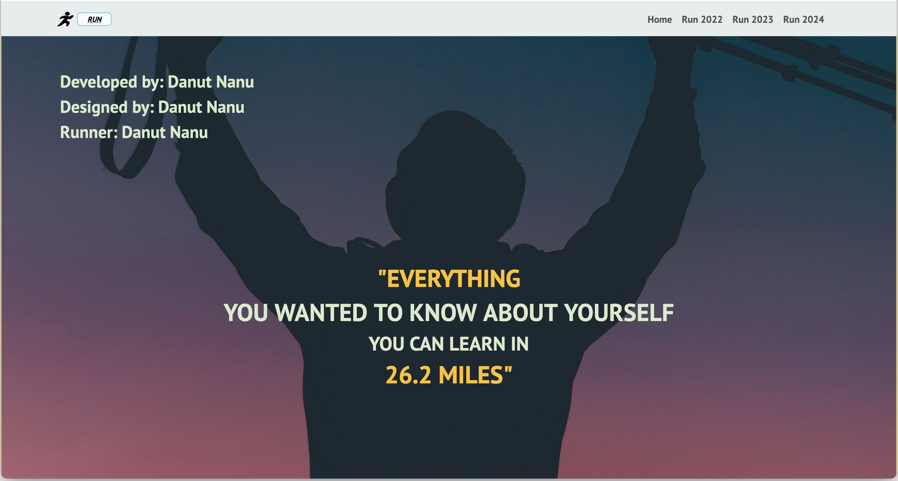

# MilesOfMemories-React

View the live site [here](https://milesofmemories.netlify.app/).

## Project Overview

This project is a continuation of the [React-Run](https://github.com/danutnanu/React-Run) project. It is a personal website that showcases my journey and experiences with long-distance running, using modern web development practices to enhance and expand its features.

## Features

- 📱 Responsive design
- 🎨 Smooth animations
- 🔗 Easy navigation

## Screenshots



## Technologies Used

- ⚛️ React
- 🎨 Bootstrap
- 🔄 react-router-dom (for dynamic routing)

## How to Use

1. **Fork the Repository**: Click the "Fork" button at the top right of this repository to create your own copy.

2. **Clone Locally**: Clone the forked repository to your local machine using:
   ```bash
   git clone <your-forked-repo-url>
   ```

3. **Navigate to the Project Directory**: Change into the project directory:
   ```bash
   cd <project-directory>
   ```

4. **Install Dependencies**: Run the following command to install all necessary dependencies:
   ```bash
   npm install
   ```

5. **Start the Application**: Once the installation is complete, start the application with:
   ```bash
   npm start
   ```

6. **View in Browser**: Open your browser and go to `http://localhost:3000` to see your local copy running.

## Contact

Feel free to reach out via [email](mailto:danutnanu@icloud.com) or [LinkedIn](https://www.linkedin.com/in/danut-nanu-7474b4267/).

